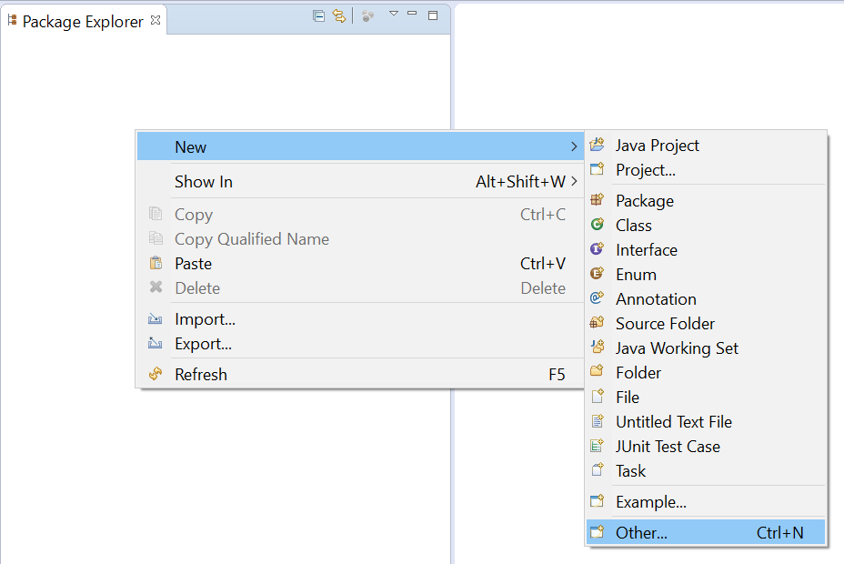
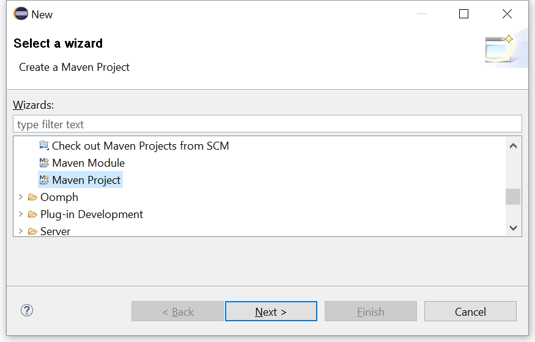
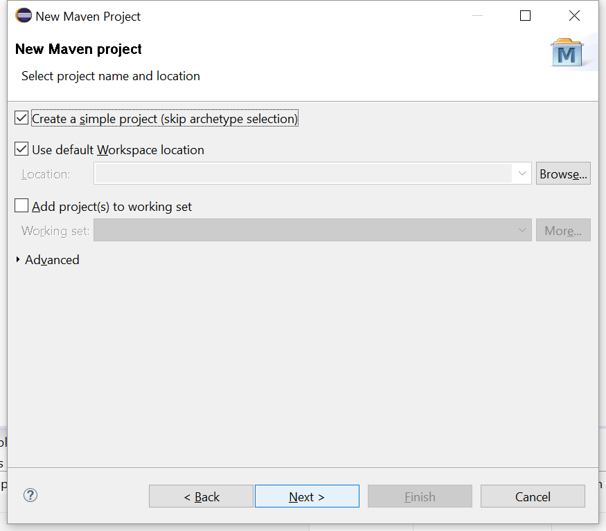
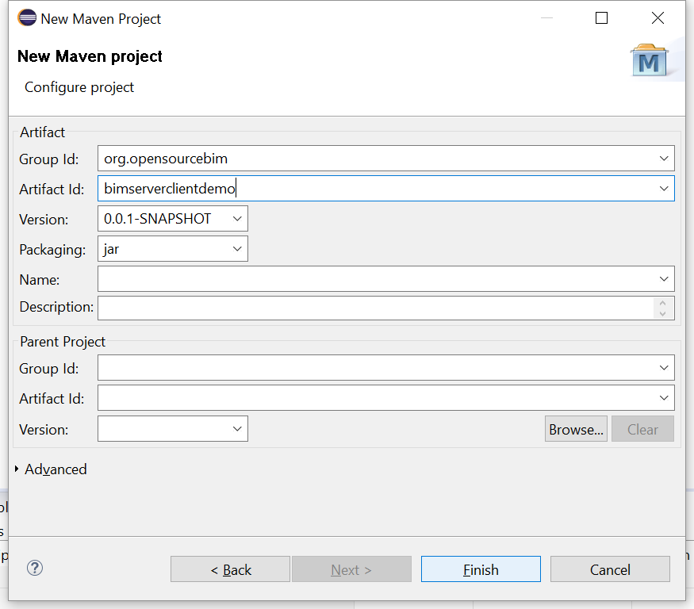
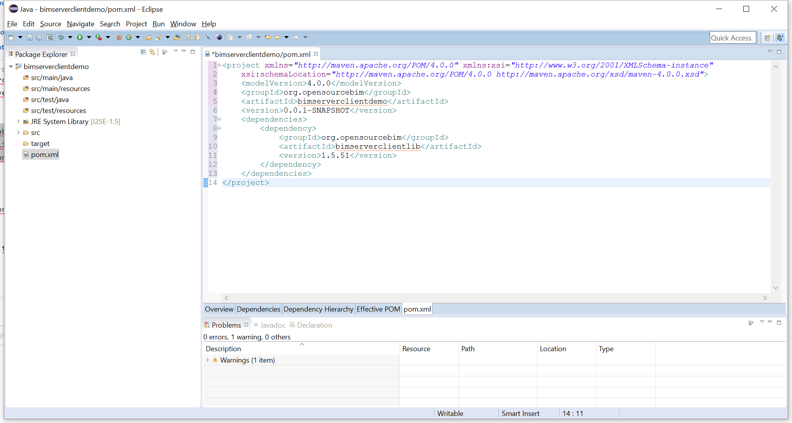
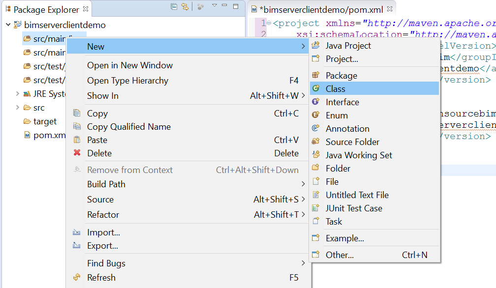
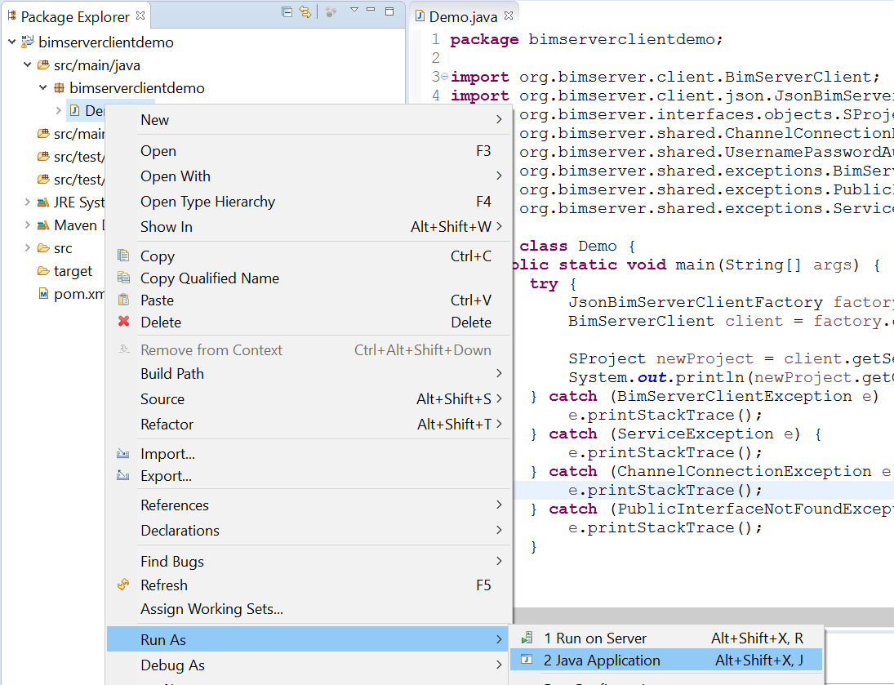
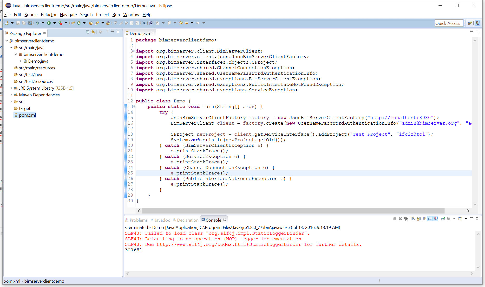

First, make sure your Eclipse version has maven support, if it hasn't you need to install the m2e plugin first.

Create a new Maven project (you can also convert an existing project to a Maven project if you want).








Edit the pom.xml file. Add the following (make sure the version of the bimserverclientlib matches with the version of BIMserver you want to connect to):
```xml
	<dependencies>
		<dependency>
			<groupId>org.opensourcebim</groupId>
			<artifactId>bimserverclientlib</artifactId>
			<version>1.5.51</version>
		</dependency>
	</dependencies>
```



Add a new Class


Copy and paste the following test-snippet:
```java
import org.bimserver.client.BimServerClient;
import org.bimserver.client.json.JsonBimServerClientFactory;
import org.bimserver.shared.ChannelConnectionException;
import org.bimserver.shared.UsernamePasswordAuthenticationInfo;
import org.bimserver.shared.exceptions.BimServerClientException;
import org.bimserver.shared.exceptions.PublicInterfaceNotFoundException;
import org.bimserver.shared.exceptions.ServiceException;

public class Main {
	public static void main(String[] args) {
		try {
			JsonBimServerClientFactory clientFactory = new JsonBimServerClientFactory("http://localhost:8080");
			BimServerClient client = clientFactory.create(new UsernamePasswordAuthenticationInfo("admin@bimserver.org", "admin"));
			client.getServiceInterface().addProject("test", "ifc2x3tc1");
		} catch (BimServerClientException | ServiceException | ChannelConnectionException e) {
			e.printStackTrace();
		} catch (PublicInterfaceNotFoundException e) {
			e.printStackTrace();
		}
	}
}
```

Run as Java application


The results (note: When you run the application a second time, you will get an error saying the project name is already used).


