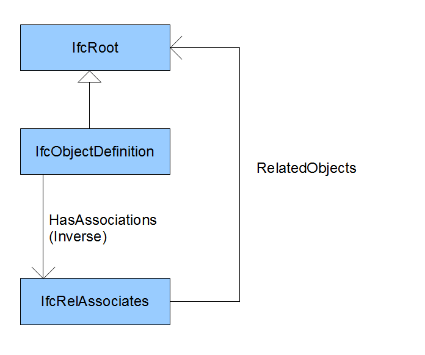
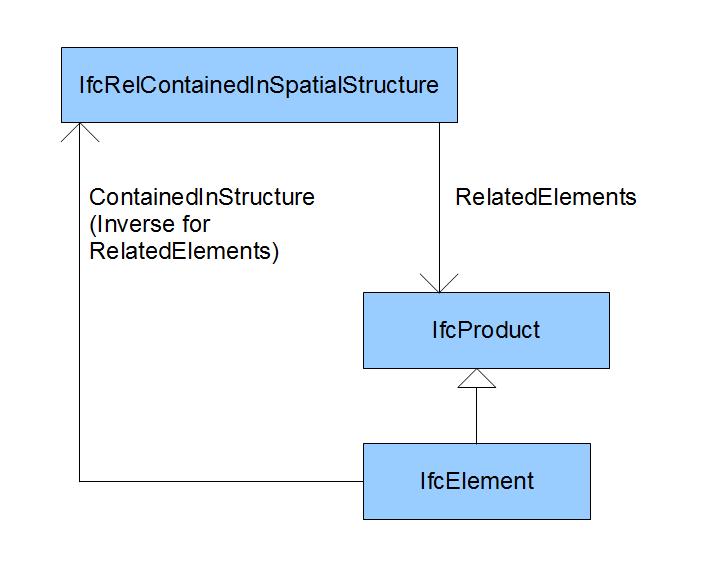

Some issues are hard/impossible to fix, therefore we mention them here.

# Paths
Because the BIMserver is starting separate processes for the IFCEngine (used for generating geometry and clasdetection), paths are a peculiar (and operating system based) thing.
For windows:
Paths can contain spaces, but not multiple spaces together:
  * Right: "C:\Program Files\BIMserver 1.0"
  * Wrong: "C:\Program Files\BIMserver  1.0"
  * For OSX: Paths cannot contain any spaces at all
  * For linux: Paths cannot contain any spaces at all

# Inverses

> Update: This has actually been fixed within BIMserver. These 12 combinations of incomplete inverses will be set by BIMserver on checkin.

IFC has the notion of "inverse" relations. EMF has the notion of "opposites", where possible those have been mapped, but it's not always possible so sometimes "inverses" won't work the way you would think.

The problem with inverses in IFC is that one can be defined on type "A", referencing a certain field on type "B" which in turn does not point to the field of type "A", but to a field on a super- or subtype of "A". EMF does not support these kind of opposites. The effect of this is that opposites won't automatically be set when setting one reference, you will have to set the other as well.

Real IFC Example:



And another:



Another case is IfcRelAssociates.RelatedObjects (IfcRoot) which does not match with its inverse IfcObject.HasAssociations (IfcRelAssociates).

You can read part of the very early discussion [here](https://github.com/opensourceBIM/BIMserver/issues/26). There is also a publication about inverse references (Section 2.2 on this mismatch issue): Tauscher H. (2022). _Analysis and effective use of inverse relation attributes in IFC_. In: Proc. 14th European Conference on Product and Process Modelling (ECPPM), Trondheim, Norway, 2022. Doi: [10.1201/9781003354222-95](https://doi.org/10.1201/9781003354222-95).


# Derived attributes

This is not really an issue, but it's good to know why not all schema data can be stored in the EMF meta model. In IFC, derived attributes can be defined, those attributes are usually calculated based on explicit attributes. Derived attributes usually do not appear in the IFC files, but there is one exception. When a derived attribute is defined, but one of the superclasses of the class has the same attribute, the field should be serialized as a "*". For serializers/deserializers, this information is necessary, but we cannot store this in the EMF meta model. Because in EMF all structural features are created only once (also when subclasses exist), so we cannot store class-specific information in the structural features.

# Eclipse/Java 7

> Note: BIMserver > 1.5 will only run on Java 8 or higher
> Note: This problem has been resolved in Eclipse Kepler

Compiling the BIMserver in Eclipse 3.7.1 and then running in Java 7 (update 2) currently generates the following error, which is probably a bug in the eclipse compiler:

```
java.lang.VerifyError: Inconsistent stackmap frames at branch target 196 in method nl.tue.buildingsmart.express.parser.Express2DictWalker.select_list(Lantlr/collections/AST;)Ljava/util/List; at offset 156
```

Update on 2012-04-09: According to the Eclipse bugtracking system this bug should be fixed in Eclipse 3.7.2 but I am still getting the error, a workaround has been posted on https://bugs.eclipse.org/bugs/show_bug.cgi?id=362591.

The workaround: Add "-XX:-UseSplitVerifier" when running.

# Select subtype of type enum

The following is an example, there could be more.

[IfcPresentationStyleSelect](https://standards.buildingsmart.org/IFC/RELEASE/IFC4/ADD2_TC1/HTML/link/ifcpresentationstyleselect.htm) has [IfcNullStyle](https://standards.buildingsmart.org/IFC/RELEASE/IFC4/ADD2_TC1/HTML/link/ifcnullstyle.htm) as a 'subtype', but IfcNullStyle is en enum. This is not supported in Java or EMF, files containing this construction will fail to deserialize at the moment.

Both the select type and the enum sub type are deprecated as of IFC 4.

# Other IFC problems

[IfcCompoundPlaneAngleMeasure](https://standards.buildingsmart.org/IFC/RELEASE/IFC4/ADD2_TC1/HTML/link/ifcpresentationstyleselect.htm) is a defined type derived from a list, which does not work in EMF/Java.

[IfcComplexNumber](https://standards.buildingsmart.org/IFC/RELEASE/IFC4/ADD2_TC1/HTML/link/ifccomplexnumber.htm) is a defined type derived from an array, which does not work in EMF/Java.


# More issues
For more know issues have a look at the [issue list](https://github.com/opensourceBIM/BIMserver/issues?state=open)

