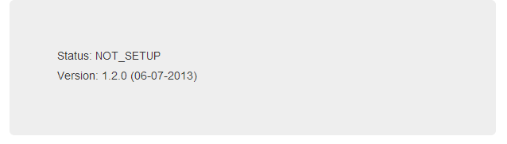
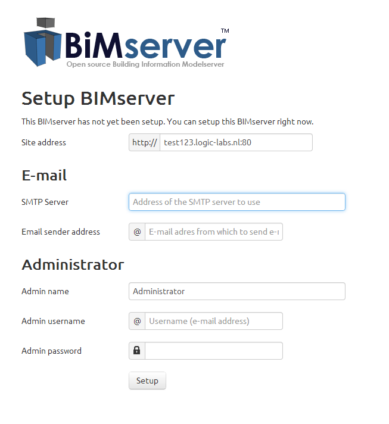
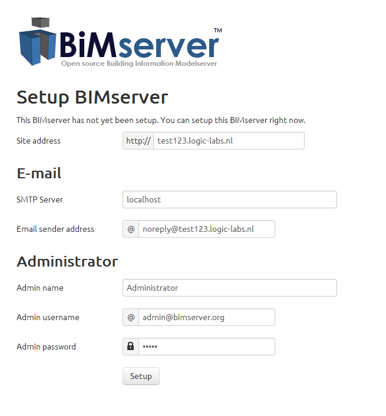

BIMserver has different modes it can be in. One of the modes is "NOT_SETUP", in this case you will need to set it up in order to start using BIMserver.

The default Web GUI of BIMserver will show the following page:

You can in theory setup a BIMserver by using API calls, but it's easier to use the Admin GUI. The Admin GUI is being bundled as a Web Module with most builds. You can access it on /apps/console. So for example: http://[YOUR DOMAIN]:[PORT]/[OPTIONAL CONTEXT PATH]/apps/console.

The setup page looks like this:

A filled in setup page can look like this:

After setup, you will be able to login as an administator with the credentials you just entered.
