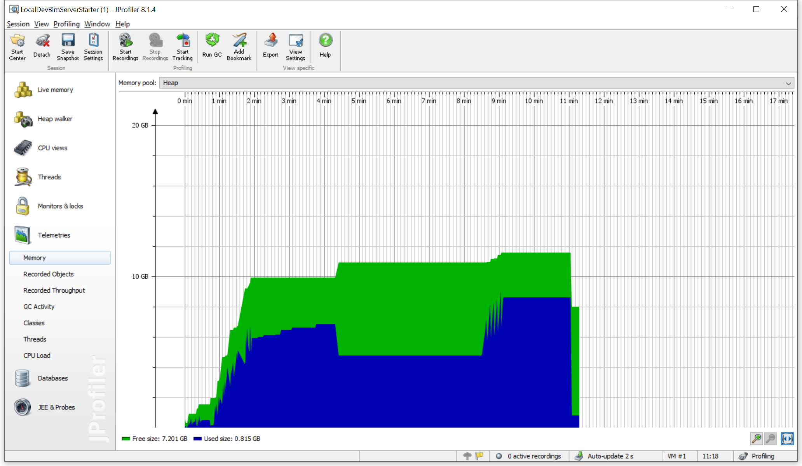
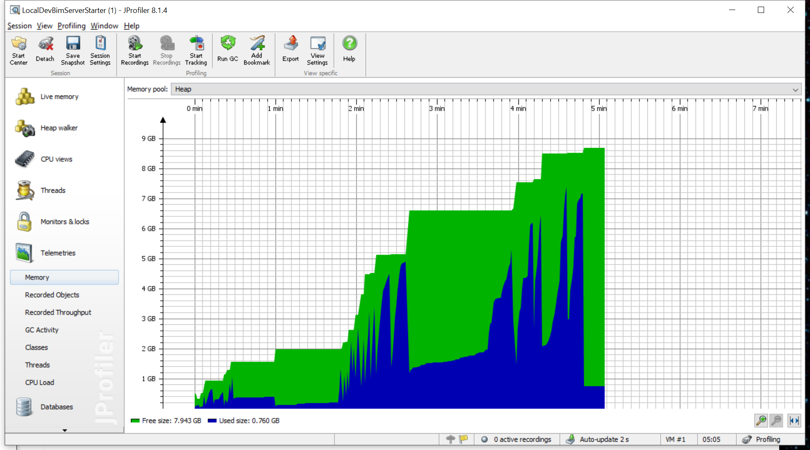

BIMserver 1.5 has undergone a few changes in order to reduce the amount of memory used during checkin and download.

# Checkin

Basically before the checkin process looked like this:
1. User uploads IFC file, deserializer parses it and stores it in an EMF model, inverses are generated automatically by EMF.
2. Geometry is generated using a Render Engine, all the geometry (can be a lot, depending on the model) is also stored in the in-memory EMF model.
3. (Which starts after step 1 and 2 are fully completed) Store the content of the EMF model in the database

Now it looks like this (when you select a "Streaming" deserializer, the old one is also still available)
1. User uploads IFC file, while it is uploading, it is also parsed on a line-by-line basis, each line is directly stored in the database and both the line (String) and object representing the IFC entity are removed from memory (well actually that happens on GC) before parsing the next line.
2. Special queries are run on the database to determine any inverses (the database stores inverses as well, to make traversal in that direction faster/easier), This only has to happen on a fraction of the model.
3. With some special queries, the geometry parts are queried and split into small groups of objects which are then serialized and sent to the Ifc Engine, the results are stored in the database as well. Only 10 elements are selected for each small IFC file, and the amount of IFC Render instances is never greater than the amount of cores in the machine. This step greatly improved the processing time on multi-core machines.

You will still see the amount of memory increase quite quickly during checken, a large portion can be attributed to the fact that BerkeleyDB is quite the aggressive cacher.

# Download

When downloading the same improvement has been made. Previously the complete model was loaded from the database into an EMF model, after that it would be serialized. Now this just happens in one go.

# Example

This is when checking in a 280MB IFC file non-streaming. The blue area indicates the amount of memory being used within the JVM (green is the amount of memory the JVM uses from the system). The steep dropoffs are the GC taking place. Base memory at the peak is about 9GB. You can see the amount of memory gradually increasing as it's building up the EMF model.

Streaming HEAP usage. Note that the base memory never exceeds 2.5GB. Also note that it only takes 5 minutes instead of 11 minutes to checkin the IFC file.
