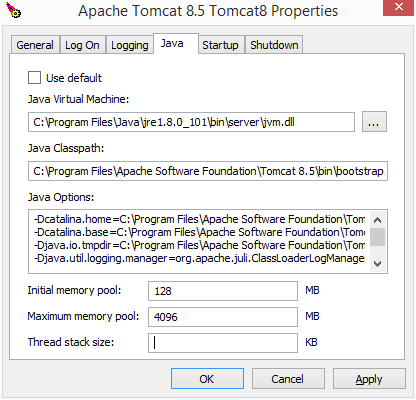

This page will help you install and configure Tomcat on Windows, focusing more on common issues when running BIMserver on Tomcat. 

# Version Requirements

To run BIMserver on Tomcat, you need version 8 or higher. Versions 8.5 and 9 have been tested and recommended.

# Steps to install Tomcats on Windows

- Download Tomcat: visit [Tomcat download page](https://tomcat.apache.org/download-90.cgi).
- Choose the "32-bit/64-bit Windows Service Installer" under the core section.
- Download the installer file and follow the installation wizard steps. 

When prompted, select the option to install Tomcat as a service. This will make it easier to configure Tomcat to start automatically when your computer boots up. 

## Setting the amount of heap memory

On windows, tomcat installs this little icon in your system tray .
Right-Click on the icon and select "Configure...". The following window will appear:

Open the Java tab and you can change the max amount of memory. Make sure you restart tomcat after changing anything. Also make sure you check whether the max amount of memory is actually correct (by going to the Tomcat admin page, or by using BIMvie.ws)
